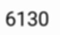
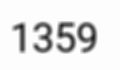

# Synthesis-Data-Generation
Synthesis data generator python implementation code,it use pillow and opencv. this code create numerical systhesis data and it's mapping txt file also.

# Systensis Data
  # Fig : 1 
  
  
  # Fig: 2
  

